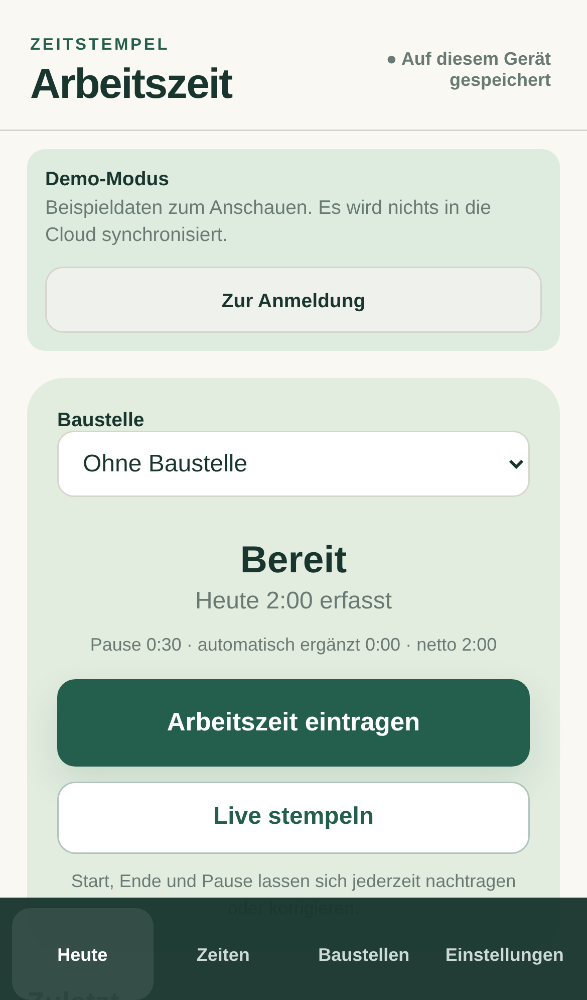

# Zeitstempel Arbeitszeiten

Eine local-first Arbeitszeiterfassung für Menschen, die keine Zeiterfassungssoftware verwalten wollen.

**Zeitstempel** ist eine installierbare PWA für iPhone und Desktop. Der Kern-Workflow ist bewusst manuell-first: Arbeitszeit, Ende und Pause lassen sich in wenigen Sekunden eintragen oder später korrigieren. Live-Stempeln bleibt als optionale Komfortfunktion erhalten, ist aber nicht Voraussetzung für korrekte Daten.

[Live-Demo ohne Login](https://arbeitszeitenapp.vercel.app/?demo=1)



## Produktprinzipien

- **Einfach an der Oberfläche:** klare deutsche Sprache, große Touch-Ziele, wenige Entscheidungen.
- **Robust unter der Haube:** jeder Schreibvorgang landet zuerst lokal in IndexedDB.
- **Offline-first:** Netzprobleme dürfen keinen Zeiteintrag verlieren.
- **Korrigierbar statt fragil:** Zeiten können jederzeit nachgetragen und geändert werden.
- **Kein Feature-Bloat:** Baustellen, Zeiten, Auswertungen und Einstellungen bleiben die vier Kernbereiche.
## Was technisch interessant ist

- React 19, Vite und TypeScript im Strict Mode
- Dexie/IndexedDB als primäre lokale Datenquelle
- persistente Outbox für Cloud-Synchronisierung
- Convex als Backend inklusive Auth und serverseitiger Benutzertrennung
- revisionsgeprüfter Sync mit erhaltenen Konfliktkopien statt stillem Last-write-wins
- Workbox-PWA mit Offline-App-Shell und iPhone-Safe-Area-Unterstützung
- zentrale Europe/Berlin-Zeitlogik für Nachtarbeit, DST und Soll-/Ist-Berechnung
- CSV- und lazy-geladener PDF-Export
- idempotente Migration alter lokaler Daten inklusive Rohdatensicherung

## Datenfluss

```text
UI
 ↓
IndexedDB / Dexie  ← sofortige lokale Speicherung
 ↓
persistente Outbox
 ↓
Convex Sync
 ↓
konto-getrennte Cloud-Daten
```

Die Oberfläche liest ebenfalls aus der lokalen Datenbank. Dadurch bleibt die App auch bei instabiler Verbindung reaktionsfähig.
## Demo und Auth

Die öffentliche Demo startet ohne Konto über:

```text
https://arbeitszeitenapp.vercel.app/?demo=1
```

Sie verwendet ein vollständig getrenntes lokales Demo-Profil und synchronisiert keine Beispieldaten zu Convex.

Echte Konten verwenden Convex Auth mit E-Mail und Passwort. Arbeitsdaten werden serverseitig anhand der authentifizierten Identität getrennt.

## Qualitätssicherung

```bash
npm ci
npm run check
npm run test:e2e
npm run audit:prod
```

`npm run check` führt Typecheck, ESLint, Vitest und den Production-Build aus. Die GitHub-Actions-Pipeline ergänzt einen Chromium-E2E-Lauf und einen Audit der Production-Dependencies.

Die Unit-Suite deckt unter anderem Domainlogik, Migration, Backup/Restore, Reports und Repository-Verhalten ab. Playwright prüft die öffentliche Demo, Live-Stempeln, Offline-Persistenz sowie Bearbeiten/Löschen/Wiederherstellen.
## Lokale Entwicklung

```bash
npm install
npm run dev
```

Lokale Convex-Konfiguration:

```env
VITE_CONVEX_URL=http://127.0.0.1:3210
VITE_CONVEX_SITE_URL=http://127.0.0.1:3211
```

Für einen lokalen Convex-Stack:

```bash
npm run convex:once
```

Das Production-Build verwendet die Convex-Cloud-Deployment-URL aus der Deployment-Umgebung.

## Installation als PWA

Auf dem iPhone: Deployment in Safari öffnen → **Teilen** → **Zum Home-Bildschirm**. Nach der ersten vollständigen Online-Ladung funktioniert die App-Shell offline; Arbeitsdaten werden ohnehin zuerst lokal gespeichert.

## Sicherheits- und Datenmodell

Convex-Funktionen ermitteln die Benutzeridentität serverseitig. Clients dürfen nicht selbst bestimmen, welchem Konto ein Datensatz gehört. Updates prüfen vorhandene Datensätze zusätzlich auf die zugehörige Benutzer-ID.

Lokale Daten bleiben pro Benutzer getrennt. Synchronisationskonflikte bewahren beide Fassungen auf, bis der Nutzer eine Version auswählt.

## Bekannte Grenzen

- Vollständige Auth-E2E-Tests gegen das echte Convex-Deployment benötigen ein separates Testkonto.
- Safari kann Website-Speicher unter extremem Speicherdruck räumen; deshalb existiert zusätzlich ein vollständiger JSON-Export.
- Die PDF-Ausgabe ist bewusst kompakt und auf Stundennachweise statt komplexes Reporting optimiert.

---

**Designziel:** powerful under the hood, langweilig einfach in der Bedienung.
